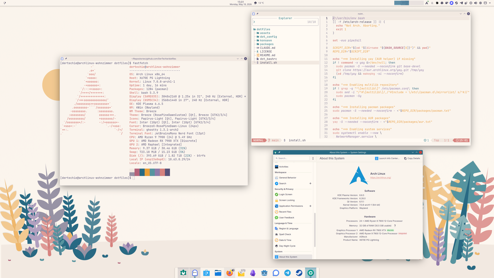

# dotfiles



My Arch Linux + KDE Plasma 6 + Rosé Pine Dawn rice.

## Restore on a fresh Arch install

```bash
git clone https://github.com/DerTechie/dotfiles.git ~/Repositories/github.com/DerTechie/dotfiles
bash ~/Repositories/github.com/DerTechie/dotfiles/install.sh
```

Log out and back in (or reboot) after the script finishes so group memberships (`docker`, `libvirt`) and the Plasma session pick up all changes.

## Stack

- **Desktop:** KDE Plasma 6, Rosé Pine Dawn theme
- **Terminal:** Ghostty with Rosé Pine Dawn/Moon (auto-switching)
- **Editor:** Neovim with LazyVim + rose-pine-dawn
- **Icons:** Papirus Light with palebrown folders
- **Font:** JetBrains Mono Nerd Font

## Manual post-install steps

- **Obsidian** — settings (theme, plugins, hotkeys, appearance) are stored per-vault under `<vault>/.obsidian/` rather than globally, so they're not managed here. After opening a vault, install the Rosé Pine theme via Settings → Appearance → Themes → Manage → search "Rosé Pine".

## Credits

- [Rosé Pine](https://rosepinetheme.com/) palette and themes
- [Papirus](https://github.com/PapirusDevelopmentTeam/papirus-icon-theme) icons
- [LazyVim](https://www.lazyvim.org/) Neovim distribution
- [Konsave](https://github.com/Prayag2/konsave) for Plasma state
- [chezmoi](https://www.chezmoi.io/) for dotfile management

## License

MIT — see [LICENSE](LICENSE).
